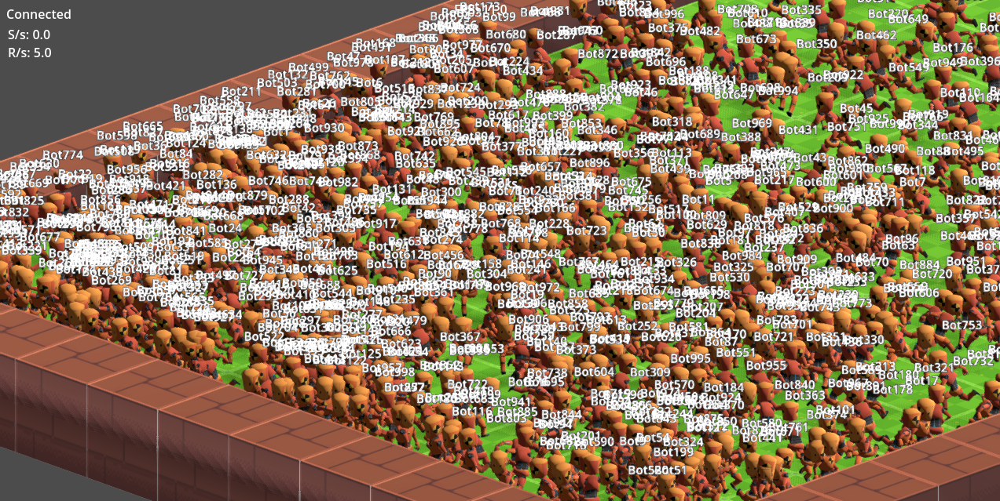

# Rust / Godot MMO
A Rust-based, real-time, online, multiplayer RPG - using Godot as a player client.

Features:
- Authoritative Rust server
- Server generates maps from text files
- Multi-threaded
- Transactional inputs: each input has a guaranteed response
- Agnostic game server: easily swap out and upgrade game servers
- Light weight Godot client
- Rust code handling networking under Godot's hood (allows shared types and libs w/ server)

# Gameplay
Here's some early gameplay footage, with 1 player and 100 scripted players, all connecting independantly via network. At the moment, the server can support over 500 players at once, but the game client loses a lot of FPS. Needs graphical optimizations.

Here's a screenshot of 1000 players at once (fps is really low due to lack of graphical optimizations)

Here's some single player footage as well

